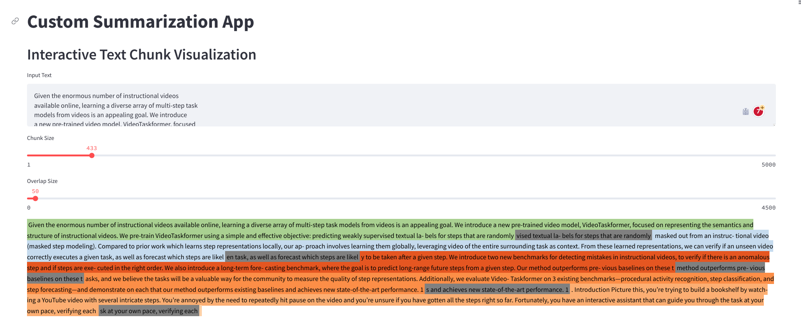

# Description

This repository contains a Python script called pdf_summarization_app.py that allows users to summarize a PDF document using natural language processing. The script uses the gradio library for building a simple web interface for users to input the PDF file path and a custom prompt for summarization.

# Installation

To use the pdf_summarization_app.py script, follow these steps:

- Clone this repository to your local machine using the following command:

```git clone https://github.com/your_username/pdf_summarization_app.git```

- Create the conda environment:

```conda env create -f environment.yml```

You can also just install the required libraries using the following command:

```pip install -r requirements.txt```

# Usage

To use the pdf_summarization_app.py script, follow these steps:

- Open a terminal and navigate to the pdf_summarization_app directory.

- Run the script using the following command:

  ```python pdf_summarization_app.py```

- Open a web browser and navigate to http://localhost:7860/.

- Enter the path to the PDF file and a custom prompt for summarization.

- Click the "Summarize" button to generate the summary and the "Custom Summarize" button to generate custom summary.

# Notebooks

This repository also contains two Jupyter notebooks entitled summarization_with_langchain.ipynb and talk_to_pdf_with_langchain.ipynb. These notebooks provide additional examples and functionality for summarizing PDF documents using natural language processing.

# Custom Summarization
I added a specialized app to construct custom summaries.
## Interactive Text Chunk Visualization
I added a text chunk visualization for the summarization app:


### Running the custom summarization app
Just run:

```streamlit run ./custom_summarization_app.py```

# Credits
This project was built using the [gradio](https://gradio.app/docs/), [langchain](https://python.langchain.com/en/latest/) and [streamlit](https://streamlit.io/) librairies.

# TODOs
- [x]  Add option to produce multiple summaries
- [x]  Create github repo
- [x]  Add custom summarization
- [x]  Add interactive tool to debug chunk size
- [ ]  Add a free option
- [ ]  Add an option to estimate cost in the case of using paid API like ChatGPT
- [ ]  Add token count option
- [ ]  Add option to create summaries for multiple papers inside a folder
- [ ]  Integrate map prompt and combine prompt
